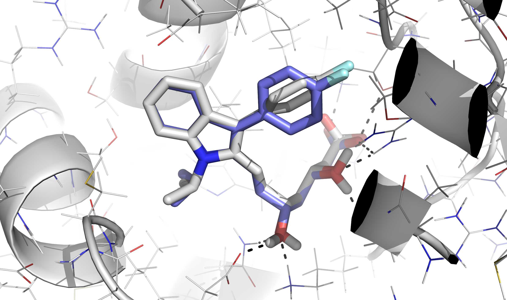
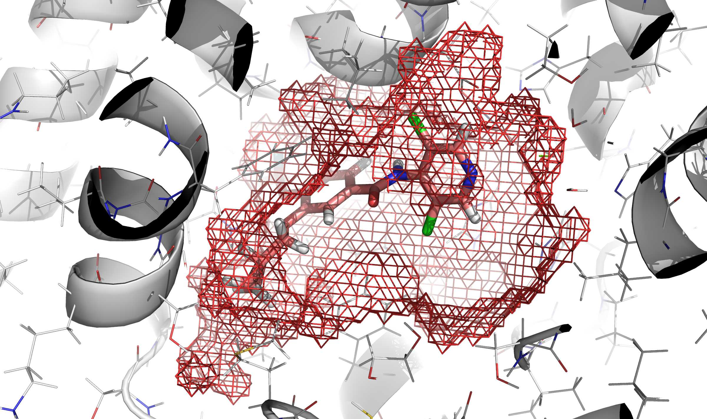

.. _rdock-documentation:

rDock: a fast, versatile, and open-source program for docking ligands to proteins and nucleic acids
===================================================================================================

rDock is a fast and versatile **open-source docking program** that can be used
to dock **small molecules** against **proteins** and **nucleic acids**. It is
designed for high-throughput virtual screening (HTVS) campaigns and binding mode
prediction studies.

rDock is mainly written in C++ and accessory scripts and programs are written in
C++, Perl or Python languages.

The full rDock software package requires **less than 50 MB** of hard disk space
and it is compilable (at this moment, **only**) in **all Linux computers**.

Thanks to its design and implementation [rDock2014]_, it can be installed on a
computation cluster and deployed on an **unlimited number of CPUs**, allowing
HTVS campaigns to be carried out in a **matter of days**.

Besides its main Docking program, the rDock software package also provides a set
of tools and scripts to facilitate **preparation** of the input files and
**post-processing** and **analysis** of results.

.. _about:

About
-----

.. _download:

Download
^^^^^^^^

Please visit rDock SourceForge page for most up to date releases.

* `Download files <https://sourceforge.net/projects/rdock/files/>`__
* `Get using SVN <https://sourceforge.net/p/rdock/code-0/HEAD/tree/>`__

Features
^^^^^^^^

   The above image illustrates the first binding mode solution for ASTEX system
   1hwi, with an RMSD of 0.88 Å.

Docking preparation
   Define cavities using **known binders** or with user-supplied **3D
   coordinates**. Allow -OH and -NH2 receptor side chains to rotate. Add
   explicit solvent molecules and structural waters. Supply pharmacophoric
   restraints as a bias to **guide docking**.

Pre-processing of input files
   Define common ligand structure for performing **tethered docking** (requires
   Open Babel Python bindings). Sort, filter or split ligand files for
   facilitating **parallelization**. Find **HTVS protocol** for optimizing
   calculation time. Pre-calculate grids to decrease subsequent calculation
   times.

Post-processing and analysis of results
   Summarize results in a tabular format. Sort, filter, merge or split results
   files. Calculate **RMSD** with a reference structure taking into account
   internal symmetries (requires Open Babel Python bindings).

Binding mode prediction
   Predict how a ligand will bind to a given molecule. The ASTEX non-redundant
   test set for proteins and DOCK and rDock test sets for RNA have been used for
   validating and comparing rDock with other programs.

High-throughput virtual screening
   Run for million of compounds in short time by exploiting the capabilities of
   computer calculation farms. Ease of **parallelization** in relatively
   unlimited CPUs to optimize HTVS running times. The DUD set has been used for
   validating rDock and comparing its performance to other reference docking
   programs.

   In red mesh, definition of the cavity obtained by execution of ``rbcavity``
   program.

History
^^^^^^^

The rDock program was developed from 1998 to 2006 by the software team at
RiboTargets (subsequently `Vernalis (R&D) Ltd <https://www.vernalis.com/>`__)
[RiboDock2004]_. In 2006, the software was licensed to the `University of York
<http://www.ysbl.york.ac.uk/>`__ for maintenance and distribution.

In 2012, Vernalis and the University of York agreed to release the program as
open-source software [rDock2014]_. This version is developed with support from
the `University of Barcelona <http://www.ub.edu/cbdd/>`__ --
`sourceforge.net/projects/rdock <https://sourceforge.net/projects/rdock/>`__.

License
^^^^^^^

rDock is licensed under GNU LGPL version 3.0.

.. toctree::
   :maxdepth: 2

   license

References
^^^^^^^^^^

If you are using rDock in your research, please cite [rDock2014]_. Former
software reference provided for completeness is [RiboDock2004]_.

.. [rDock2014] Ruiz-Carmona, S., Alvarez-Garcia, D., Foloppe, N.,
	       Garmendia-Doval, A. B., Juhos S., et al. (2014) rDock: A Fast,
	       Versatile and Open Source Program for Docking Ligands to Proteins
	       and Nucleic Acids. PLoS Comput Biol 10(4): e1003571.
	       `doi:10.1371/journal.pcbi.1003571 <https://doi.org/10.1371/journal.pcbi.1003571>`__

.. [RiboDock2004] Morley, S. D. and Afshar, M. (2004) Validation of an empirical
		  RNA-ligand scoring function for fast flexible docking using
		  RiboDock®. J Comput Aided Mol Des, 18: 189--208.
		  `doi:10.1023/B:JCAM.0000035199.48747.1e <https://doi.org/10.1023/B:JCAM.0000035199.48747.1e>`__

.. _getting-started-guide:

Getting started guide
---------------------

In this section, you have the documentation with installation and validation
instructions for first-time users.

To continue with a short validation experiment (contained in the :ref:`Getting
started guide <getting-started-guide>`), please visit the :ref:`Validation
experiments section <validation-experiments>`.

.. toctree::
   :maxdepth: 2
   :caption: Contents:

   getting-started-guide/overview
   getting-started-guide/quick-and-dirty-installation
   getting-started-guide/prerequisites
   getting-started-guide/unpacking
   getting-started-guide/building
   getting-started-guide/validation-experiments

.. _reference-guide:

Reference guide
---------------

In this section you can find the documentation containing full explanation of
all rDock software package and features.

For installation details and first-users instructions, please visit
:ref:`Installation <quick-and-dirty-installation>` and :ref:`Getting started
<getting-started-guide>` sections.

.. toctree::
   :maxdepth: 2
   :caption: Contents:

   reference-guide/preface
   reference-guide/acknowledgements
   reference-guide/introduction
   reference-guide/configuration
   reference-guide/cavity-mapping
   reference-guide/scoring-functions
   reference-guide/docking-protocol
   reference-guide/system-definition-file
   reference-guide/atom-typing
   reference-guide/file-formats
   reference-guide/programs
   reference-guide/use-cases
   reference-guide/appendix

Tutorials
---------

.. toctree::
   :maxdepth: 2
   :caption: Contents:

   tutorials/index

.. _support:

Support
-------

If you are having some trouble regarding usage, compilation, development or
anything else, you can use different options to ask for support.

Mailing lists
^^^^^^^^^^^^^

If you are having any kind of trouble, you have any questions or anything
related to general usage of the program please search and use our `mailing lists
<https://sourceforge.net/p/rdock/mailman/>`__.

Issue tracker
^^^^^^^^^^^^^

Mostly for developers and code-related problems. If you find any bug, e.g.,
please go to `tickets section in rDock SourceForge website
<https://sourceforge.net/p/rdock/tickets/>`__.
