Cavity mapping
==============

Virtual screening is very rarely conducted against entire macromolecules. The
usual practice is to dock small molecules in a much more confined region of
interest. |Dock| makes a clear distinction between the region the ligand is
allowed to explore (known here as the docking site), and the receptor atoms that
need to be included in order to calculate the score correctly. The former is
controlled by the cavity mapping algorithm, whilst the latter is scoring
function dependent as it depends on the distance range of each component term
(for example, vdW range >> polar range). For this reason, it is usual practice
with |Dock| to prepare intact receptor files (rather than truncated spheres
around the region of interest), and to allow each scoring function term to
isolate the relevant receptor atoms within range of the docking site.

|Dock| provides two methods for defining the docking site:

* Two sphere method
* Reference ligand method

The two methods are explained and illustrated below using PDB structure 2hr1.

.. note::

   All the keywords found in capital letters in following cavity mapping methods
   explanation (e.g. ``RADIUS``), make reference to the parameters defined in
   ``prm`` |Dock| configuration file. For more information, go to :ref:`Cavity
   mapping subsection <sdf-cavity-mapping>` in :ref:`System definition file
   section <system-definition-file>`.

Two sphere method
-----------------

The two sphere method aims to find cavities that are accessible to a small
sphere (of typical atomic or solvent radius) but are inaccessible to a larger
sphere. The larger sphere probe will eliminate flat and convex regions of the
receptor surface, and also shallow cavities. The regions that remain and are
accessible to the small sphere are likely to be the nice well defined cavities
of interest for drug design purposes.

The method is explained and illustrated in
:numref:`Figure %s <figure-two-sphere-method-1>`,
:numref:`Figure %s <figure-two-sphere-method-2>`,
:numref:`Figure %s <figure-two-sphere-method-3>`,
:numref:`Figure %s <figure-two-sphere-method-4>`,
:numref:`Figure %s <figure-two-sphere-method-5>`,
:numref:`Figure %s <figure-two-sphere-method-6>`, and
:numref:`Figure %s <figure-two-sphere-method-7>`.

.. _figure-two-sphere-method-1:

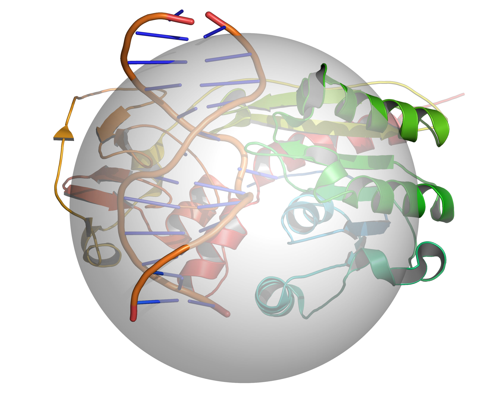

   A grid is placed over the cavity mapping region, encompassing a sphere of
   radius = ``RADIUS``, center = ``CENTER``. Cavity mapping is restricted to
   this sphere. All cavities located will be wholly within this sphere. Any
   cavity that would otherwise protrude beyond the cavity mapping sphere will be
   truncated at the periphery of the sphere.

.. _figure-two-sphere-method-2:

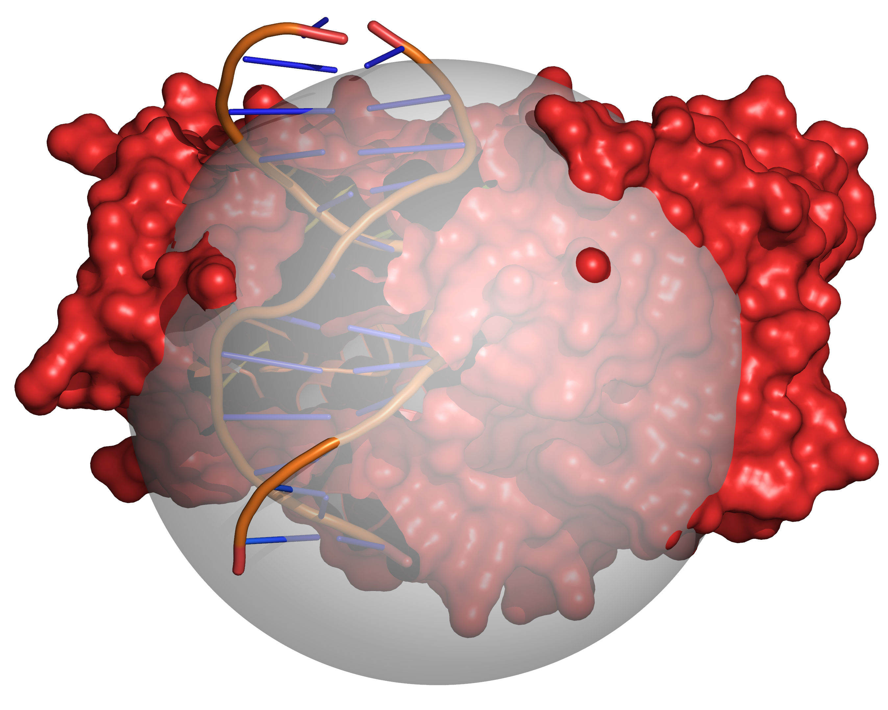

   Grid points within the volume occupied by the receptor are excluded (coloured
   red). The radii of the receptor atoms are increased temporarily by
   ``VOL_INCR`` in this step.

.. _figure-two-sphere-method-3:

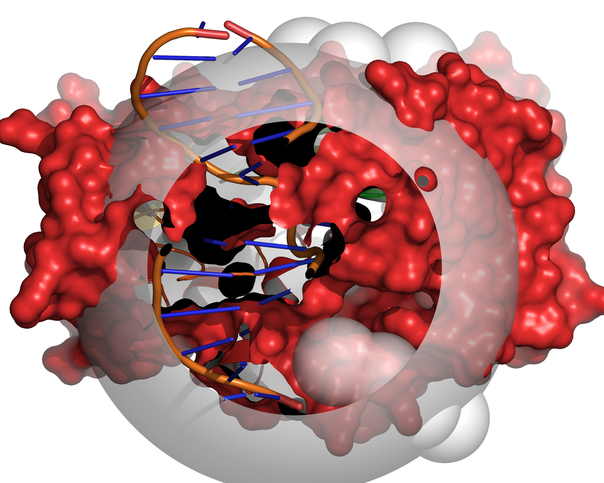

   Probes of radii ``LARGE_SPHERE`` are placed on each remaining unallocated
   grid point and checked for clashes with receptor excluded volume. To
   eliminate edge effects, the grid is extended beyond the cavity mapping region
   by the diameter of the large sphere (for this step only). This allows the
   large probe to be placed on grid points outside of the cavity mapping region,
   yet partially protrude into the cavity mapping region.

.. _figure-two-sphere-method-4:

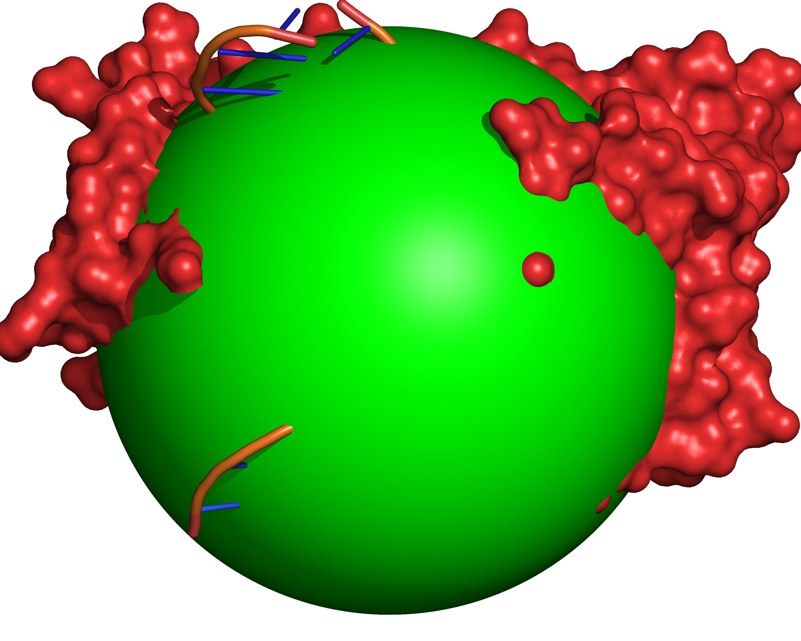

   All grid points within the cavity mapping region that are accessible to the
   large probe are excluded (coloured green).

.. _figure-two-sphere-method-5:

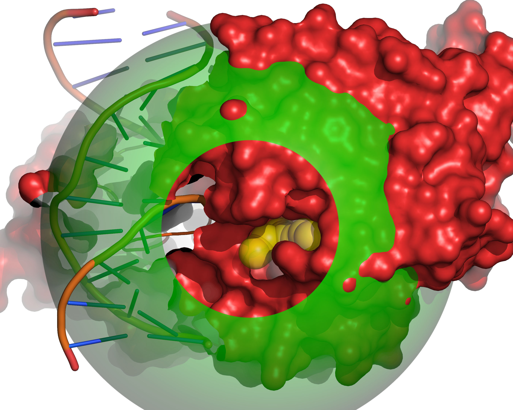

   Probes of radii ``SMALL_SPHERE`` are placed on each remaining grid point and
   checked for clashes with receptor excluded volume (red) or large probe
   excluded volume (green).

.. _figure-two-sphere-method-6:

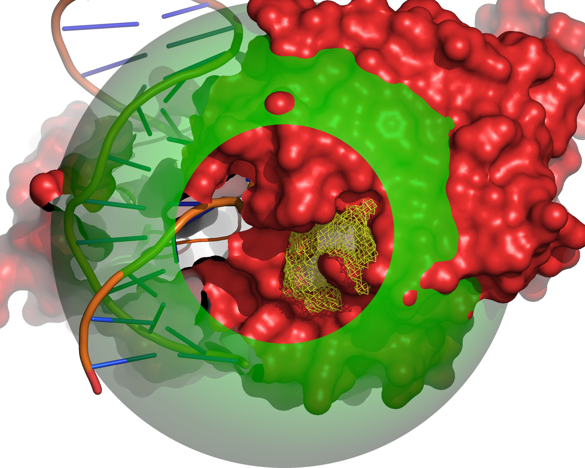
 
   All grid points that are accessible to the small probe are selected (yellow).

.. _figure-two-sphere-method-7:

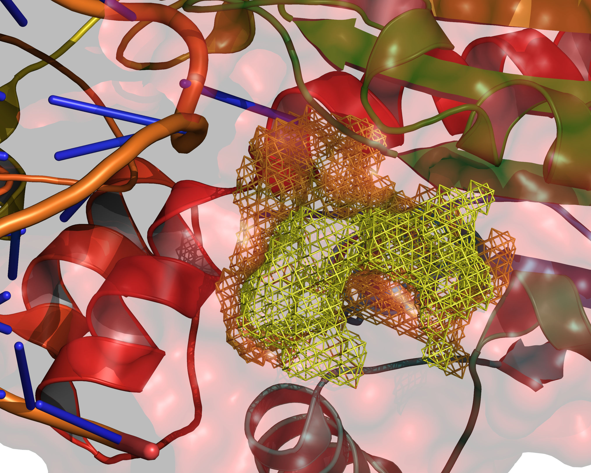

   The final selection of cavity grid points is divided into distinct cavities
   (contiguous regions). In this example only one distinct cavity is found.
   User-defined filters of ``MIN_VOLUME`` and ``MAX_CAVITIES`` are applied at
   this stage to select a subset of cavities if required. Note that the filters
   will accept or reject intact cavities only.

Reference ligand method
-----------------------

The reference ligand method provides a much easier option to define a docking
volume of a given size around the binding mode of a known ligand, and is
particularly appropriate for large scale automated validation experiments.

The method is explained and illustrated in
:numref:`Figure %s <figure-reference-ligand-method-1>`,
:numref:`Figure %s <figure-reference-ligand-method-2>`,
:numref:`Figure %s <figure-reference-ligand-method-3>`, and
:numref:`Figure %s <figure-reference-ligand-method-4>`.

.. _figure-reference-ligand-method-1:

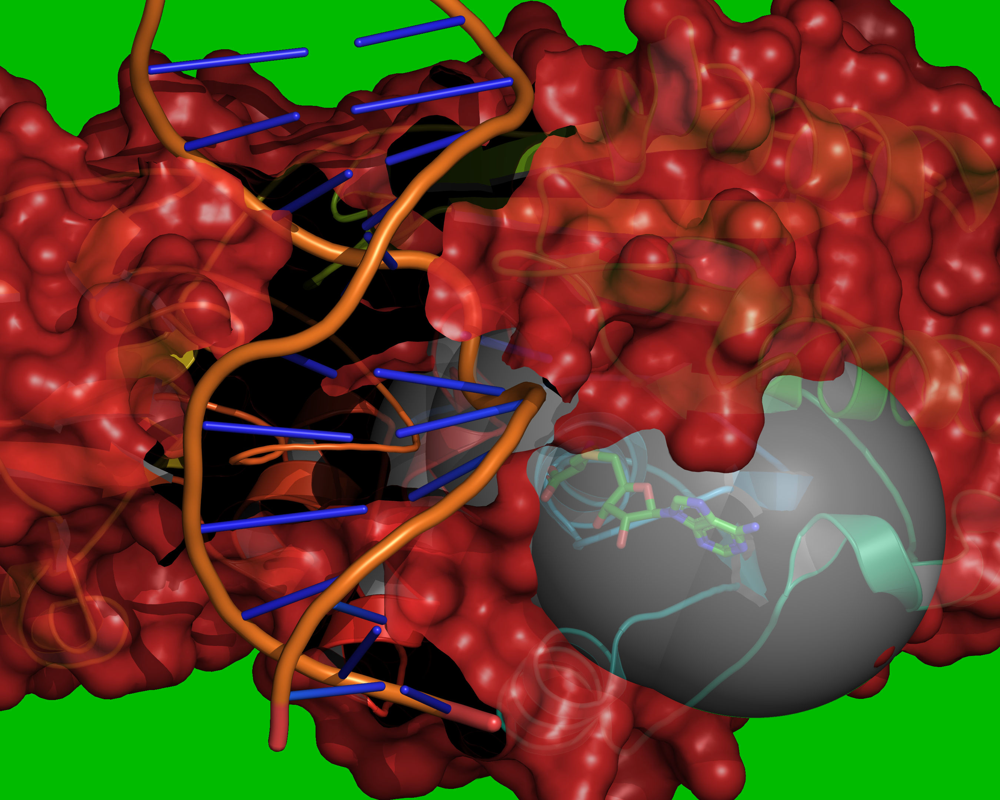

   Reference coordinates are read from ``REF_MOL``. A grid is placed over the
   cavity mapping region, encompassing overlapping spheres of radius =
   ``RADIUS``, centered on each atom in ``REF_MOL``. Grid points outside of the
   overlapping spheres are excluded (coloured green). Grid points within the
   volume occupied by the receptor are excluded (coloured red). The vdW radii of
   the receptor atoms are increased by ``VOL_INCR`` in this step.

.. _figure-reference-ligand-method-2:

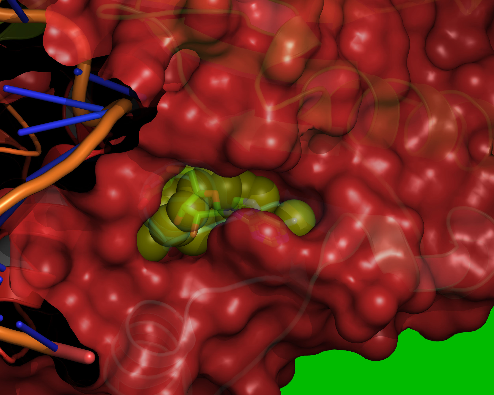

   Probes of radii ``SMALL_SPHERE`` are placed on each remaining grid point and
   checked for clashes with red or green regions.

.. _figure-reference-ligand-method-3:

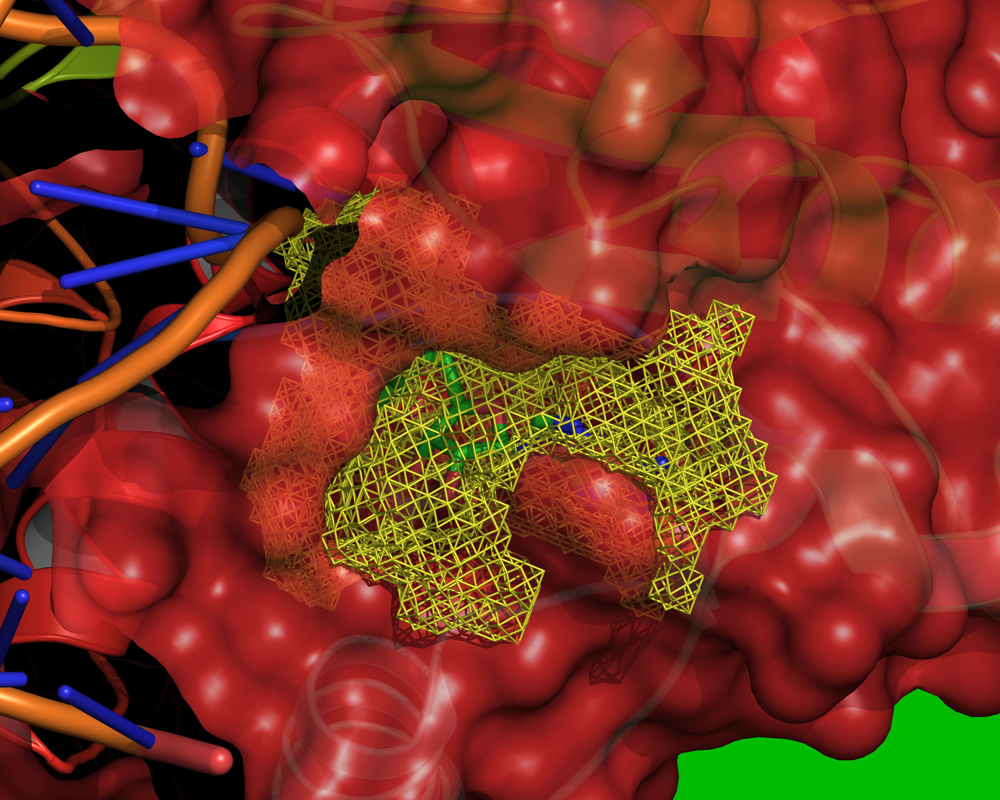

   All grid points that are accessible to the small probe are selected (yellow).

.. _figure-reference-ligand-method-4:

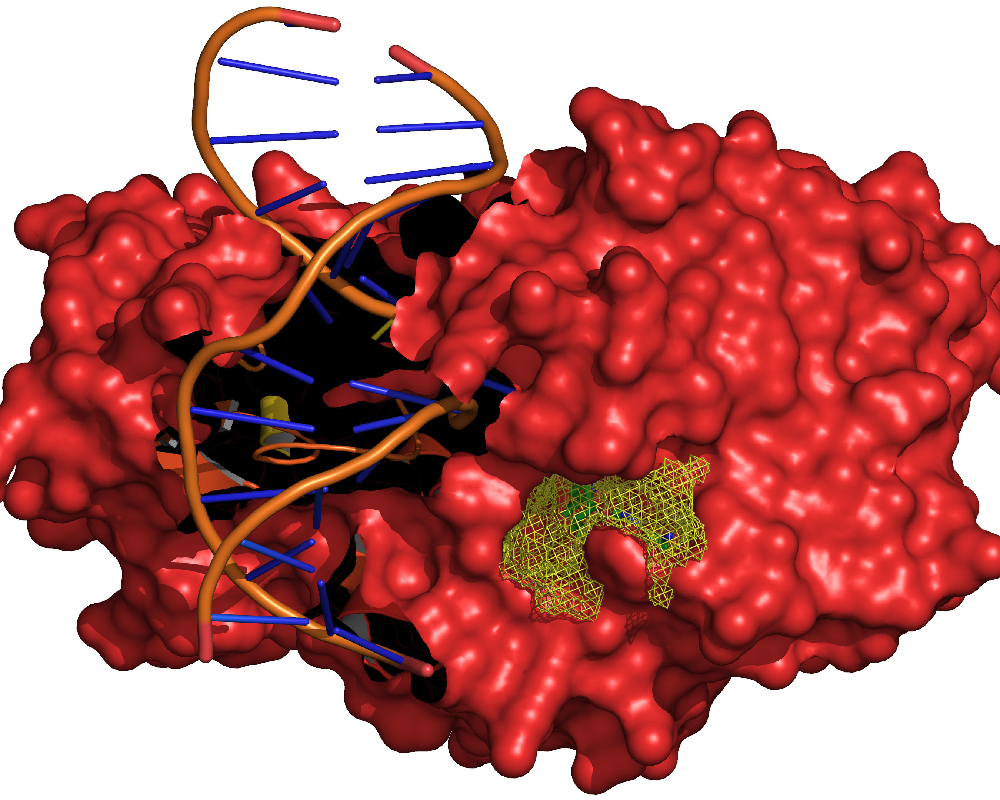

   The final selection of cavity grid points is divided into distinct cavities
   (contiguous regions). In this example only one distinct cavity is found.
   User-defined filters of ``MIN_VOLUME`` and ``MAX_CAVITIES`` are applied at
   this stage to select a subset of cavities if required. Note that the filters
   will accept or reject intact cavities only.
